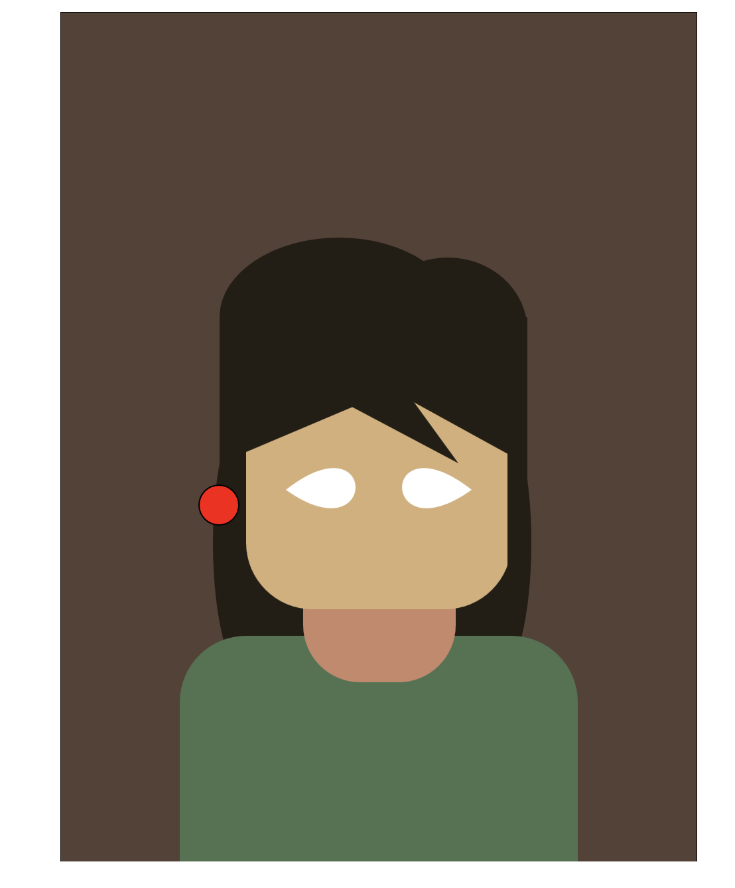

# Art Jam

AUTHOR NAME: Olivia Ho

[View this project online](https://oliv-codes.github.io/CART-253/Art-Jam/)

## Description

> This is a simple self protrait.

> I used a bezier for the first time. I used it for some eyes. It was very finicky to use, but I got it to work.

> You may click to make me blink! This is my conditional.

> You may use the mouse to give me a clown nose. This is my use of mouseX and mouseY

> Background turns to black as a new backdrop appears. This is my variable.

## Screenshot(s)

This bit should have some images of the program running so that the reader has a sense of what it looks like. For example:

> 

## Attribution

This bit should attribute any code, assets or other elements used taken from other sources. For example:

> - This project uses [p5.js](https://p5js.org).
> - The clown image is a capture of the clown from the Apple emoji character set.
> - The barking sound effect is "single dog bark 1" by crazymonke9 from freesound.org: https://freesound.org/people/crazymonke9/sounds/418107/

## License

This bit should include the license you want to apply to your work. For example:

> This project is licensed under a Creative Commons Attribution ([CC BY 4.0](https://creativecommons.org/licenses/by/4.0/deed.en)) license with the exception of libraries and other components with their own licenses.